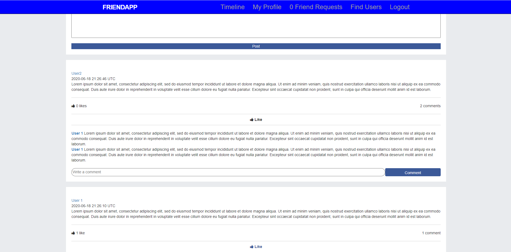

<head>
  <meta property="og:image" content="images/app.png">
</head>

# Facebook Clone

A Facebook-like app built with Ruby on Rails, HTML, and CSS.

 

The objective of this project is to build a replica that uses all the core logic of Facebook.

## Features

- Sign in to the app using Facebook account
- Send and receive friends Requests
- View posts from accepted friends
- Edit your profile

## Ideas for improvement

- Make the design looks more like the real Facebook
- Add a real-time messaging system
- Add an option for users to upload a profile image

## Built With

- Ruby language
- Ruby on Rails framework
- Vscode for coding
- Rubocop for Validation

## Live Demo

[Live Demo Link](https://face-clone-book.herokuapp.com)

# Gems
- devise
- omniauth-facebook
- capybara
- rspec-rails

## Getting started

To get started with the app, clone the repo, and then install the needed gems:

```
$ bundle install --without production
```

Next, migrate the database:

```
$ rails db:migrate
```

Finally, run the test suite to verify that everything is working correctly:

```
$ rails test
```

If the test suite passes, you'll be ready to run the app in a local server:

```
$ rails server
```

For more information, see the
[*The Odin Project*](https://www.theodinproject.com/courses/ruby-on-rails/lessons/final-project).
## Authors

👤 **Selma Ndi**

- Github: [@githubhandle](https://github.com/Datagirlcmr)
- Twitter: [@twitterhandle](https://twitter.com/SelmaNdi)
- Linkedin: [linkedin](https://www.linkedin.com/in/selma-ndi-datagirl-imba-8976ab32/)
- Email: [datagirlcmr@gmail.com](datagirlcmr@gmail.com)

👤 **Vinicius Carvalho**

<a href="https://github.com/kazumaki" rel="noopener noreferrer" target="_blank">

   

</a>

- Github: [@kazumaki](https://github.com/kazumaki)
- Twitter: [@iKazumaki](https://twitter.com/iKazumaki)
- Linkedin: [Vinicius Campos Carvalho](https://www.linkedin.com/in/vcamposcarvalho/)
- Email: [vcampos.pitangui@gmail.com](vcampos.pitangui@gmail.com)

## 🤝 Contributing

Contributions, issues, and feature requests are welcome!

Feel free to check the [issues page](https://github.com/Datagirlcmr/facebook-clone/issues).

## Show your support

Give a ⭐️ if you like this project!

## Acknowledgments

- MicroverseInc(https://www.microverse.org/)
- Odin Project(https://www.theodinproject.com/courses/ruby-on-rails/lessons/final-project)


## 📝 License

This project is [MIT](lic.url) licensed.
